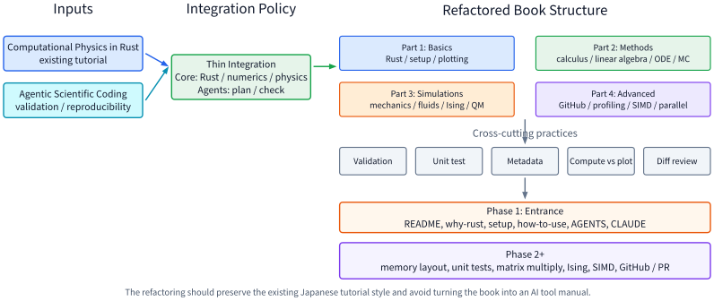

# 全体設計メモ

このメモは、`rust-computational-physics-tutorial` に
`agentic_scientific_coding` の検証・再現性・AI agent 利用の観点を
薄く統合するためのリファクタリング地図である。主教材はあくまで
Rustで計算物理を学ぶ本として維持し、AI agent、Git、GitHub、再現性は
科学計算コードを書く作法として必要な箇所に差し込む。

## 参照元

- 主教材: `rust-computational-physics-tutorial`
- 統合元: `agentic_scientific_coding`
  - 公開版: <https://shinaoka.github.io/agentic_scientific_coding/>
  - GitHub: <https://github.com/shinaoka/agentic_scientific_coding>

## 図

Typst source は [overall-design.typ](./overall-design.typ) に置く。

## 読み方

図の左側は入力となる教材、中央は統合方針、右側は統合後の章構成を表す。
下段の横断レイヤーは、各章に短く追加する共通観点である。特に
validation、unit test、metadata、compute/plot separation、diff review は、
章ごとの本文や演習に薄く繰り返し入れる。

Phase 1 は入口部分の最小統合に限る。第2章以降の memory layout、unit test、
matrix multiplication、Ising model、SIMD、GitHub/PR は Phase 2 以降で
個別に扱う。

## Phase 1

- `src/README.md`
- `src/ch01-introduction/why-rust.md`
- `src/ch01-introduction/setup.md`
- `src/ch01-introduction/how-to-use.md`
- `AGENTS.md`
- `CLAUDE.md`

目的は、Rust計算物理教材の入口に AI agent 時代の読み方と検査の作法を
短く足すことである。章構成は大きく変えない。

詳細な実装計画は
[Phase 1 Entrance Integration Implementation Plan](../superpowers/plans/2026-06-07-phase-1-entrance-integration.md)
に置く。

## Phase 2 以降

- 第2章に memory layout、関数化、モジュール化、unit test を追加する。
- 第4章に matrix multiplication の検証・benchmark 演習を追加する。
- 第12章の Ising model を project exercise として完結させる。
- 第14章または第15章に SIMD/performance project を置く。
- GitHub/PR は後半の共同開発フローとして扱う。
