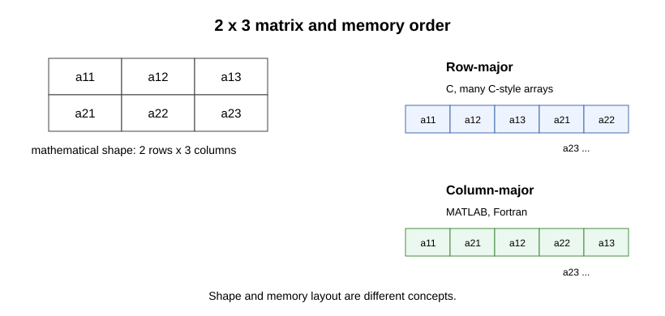

# 連続アクセス・stride・データ配置

多次元データも、メモリ上では基本的に1次元に並びます。
そのため、2次元配列をどの順序で1次元メモリに対応させるかが重要になります。

## 論理メモリ番地は1次元

プログラムから見るメモリ番地は、基本的に1次元の並びです。
実際の物理メモリはページ単位で対応づけられ、OSやMMUによる変換を受けますが、
プログラムは通常、連続した論理アドレス空間を使っているように見えます。

```text
address:  ... 1000 1008 1016 1024 1032 1040 ...
value:        a[0] a[1] a[2] a[3] a[4] a[5]
```

`Vec<f64>` の要素は、この1次元のアドレス空間の中で連続して並びます。
`f64` は8バイトなので、隣の要素へ進むことは、典型的にはアドレスを8バイト進めることに対応します。

一方、2次元配列の添字 `u[i, j]` は、数学的には2つの添字を持ちます。
しかし、メモリ番地は1次元なので、実装では `i` と `j` を1つのindexへ変換します。
この変換の約束が row-major、column-major、stride です。

## row-major と column-major

2次元配列 `u[i, j]` の並べ方には、代表的に次の2つがあります。

- **row-major**: 同じ行の要素が連続する。C/C++、Rustの多くの表現、NumPyの標準に近い。
- **column-major**: 同じ列の要素が連続する。Fortran、MATLAB、LAPACK/BLASでよく使われる。



ここでは、`nx` 行 `ny` 列の配列を考えます。
`i` を行index、`j` を列indexとすると、row-major では典型的に次の対応になります。

```text
index(i, j) = i * ny + j
```

このとき、`j` を1つ増やすとメモリ上でも隣の要素へ進みます。
`i` を1つ増やすと `ny` 要素分だけ進みます。

column-major では、同じ形の配列を次のように対応させます。

```text
index(i, j) = j * nx + i
```

このとき、`i` を1つ増やすとメモリ上でも隣の要素へ進みます。
`j` を1つ増やすと `nx` 要素分だけ進みます。

## stride

**stride** は、ある添字を1つ進めたとき、メモリ上で何要素進むかを表します。

`nx` 行 `ny` 列の2次元配列では、典型的には次のようになります。

row-major:

- `j` 方向の stride: 1
- `i` 方向の stride: `ny`

column-major:

- `i` 方向の stride: 1
- `j` 方向の stride: `nx`

stride が1の方向に読むと、メモリ上で連続したアクセスになります。
stride が大きい方向に読むと、飛び飛びのアクセスになります。

## N次元の場合

多次元配列でも考え方は同じです。
形状を `(n0, n1, ..., n_{d-1})`、添字を `(i0, i1, ..., i_{d-1})`
と書くと、index は各添字とstrideの積の和になります。

```text
index = i0 * stride0 + i1 * stride1 + ... + i_{d-1} * stride_{d-1}
```

row-major では右端の添字が最も速く変わります。

```text
strides = (n1 * n2 * ... * n_{d-1}, ..., n_{d-1}, 1)
```

column-major では左端の添字が最も速く変わります。

```text
strides = (1, n0, n0 * n1, ..., n0 * n1 * ... * n_{d-2})
```

この規約は、数学的な形状そのものとは別です。
同じ `2 x 3` の行列でも、row-major と column-major では1次元bufferへの並び方が変わります。
`ndarray` のような配列型では、shape に加えて stride などのmetadataを持つことで、
同じbufferをさまざまな見方で扱えます。

## loop order

row-major のデータでは、内側のloopで `j` を回すと連続アクセスになります。

```rust
for i in 0..nx {
    for j in 0..ny {
        let value = u[i * ny + j];
        // valueを使う
    }
}
```

逆に、内側のloopで `i` を回すと、`ny` 要素ずつ飛ぶアクセスになります。

```rust
for j in 0..ny {
    for i in 0..nx {
        let value = u[i * ny + j];
        // valueを使う
    }
}
```

小さい配列では差が見えないこともあります。
しかし、大きな配列や何度も繰り返す計算では、この違いが実行時間に効きます。

## 第4章への接続

第4章では、実際に `Vec<f64>` や `ndarray` を使って多次元データを扱います。
本節で見た row-major、stride、loop order は、そのときの土台になります。
