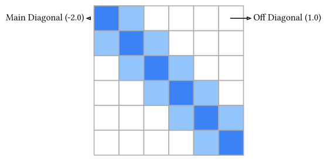

# スパース行列

物理シミュレーション、特に偏微分方程式を差分法や有限要素法で離散化する場合、現れる行列は「ほとんどの成分がゼロ」という特徴を持ちます。このような行列を**スパース行列（疎行列、Sparse Matrix）**と呼びます。

例えば、1次元の拡散方程式を差分化すると、各点は隣接する2点と自分自身の計3点としか関係を持ちません。行列のサイズが $1000 times 1000$ であっても、非ゼロ成分は1行あたり3個、全体でも約3000個しかありません。これを $1000 times 1000$ の密行列（Dense Matrix）としてメモリに確保するのは、メモリ容量の無駄であり、計算速度も著しく低下します。

## スパース行列の格納形式

スパース行列を効率的に扱うために、非ゼロ成分の値とそのインデックスだけを記録する形式が用いられます。代表的な形式に **CSR (Compressed Sparse Row)** 形式があります。

### CSR形式

以下の行列 $A$ を考えます。

$$
A = mat(
  1, 0, 0, 2;
  0, 3, 0, 0;
  4, 0, 5, 0;
  0, 0, 0, 6
)
$$



CSR形式では、以下の3つの配列でこれを表現します。

1. `values`: 非ゼロ成分の値（行順に詰める）\
   `[1, 2, 3, 4, 5, 6]`
2. `col_indices`: 各非ゼロ成分の列番号\
   `[0, 3, 1, 0, 2, 3]`
3. `row_offsets`: 各行の開始位置（`values`配列内でのインデックス）。最後の要素は非ゼロ成分の総数。\
   `[0, 2, 3, 5, 6]`
   - 0行目は `values[0..2]`
   - 1行目は `values[2..3]`
   - ...

この形式により、行列ベクトル積 $vb(y) = A vb(x)$ を計算する際、ゼロ成分の計算をスキップでき、計算量を $O(N^2)$ から $O(N_("nz"))$（$N_("nz")$は非ゼロ成分数）に削減できます。

## `sprs` クレートによる実装

Rustでスパース行列を扱うためのクレートとして `sprs` があります。`ndarray` とも相互運用性があります。

`Cargo.toml` に以下を追加します。

```toml
[dependencies]
sprs = "0.11"
ndarray = "0.17"
```

### スパース行列の構築

最も簡単な構築方法は、`(行, 列, 値)` のトリプレット形式でデータを準備し、そこからCSR形式などに変換することです。

```rust,noplayground
use sprs::TriMat;
use ndarray::arr1;

fn main() {
    let rows = 4;
    let cols = 4;
    // トリプレット形式 (Triplet Format) で初期化
    let mut triplet = TriMat::new((rows, cols));

    // (row, col, value) を追加
    triplet.add_triplet(0, 0, 1.0);
    triplet.add_triplet(0, 3, 2.0);
    triplet.add_triplet(1, 1, 3.0);
    triplet.add_triplet(2, 0, 4.0);
    triplet.add_triplet(2, 2, 5.0);
    triplet.add_triplet(3, 3, 6.0);

    // CSR形式に変換
    let a_csr = triplet.to_csr::<usize>();

    println!("CSR Matrix:\n{:?}", a_csr);

    // 行列ベクトル積
    let x = arr1(&[1.0, 1.0, 1.0, 1.0]);

    // sprsの行列とndarrayのベクトルの積
    // 結果も ndarray のベクトルになる
    let y = &a_csr * &x;

    println!("y = A * x = {}", y);
    // 期待値:
    // row0: 1*1 + 0 + 0 + 2*1 = 3
    // row1: 3*1 = 3
    // row2: 4*1 + 5*1 = 9
    // row3: 6*1 = 6
    // y = [3, 3, 9, 6]
}
```

### 1次元ラプラシアン行列の例

物理シミュレーションでよく現れる、1次元の2階微分演算子（ラプラシアン）を差分化した行列を作成してみましょう。

$$
dv(u, x, s: 2) approx frac(u_(i+1) - 2u_i + u_(i-1), h^2)
$$

行列の形は三重対角行列（Tridiagonal Matrix）になります。

```rust,noplayground
use sprs::TriMat;

fn main() {
    let n = 10; // グリッド点数
    let mut triplet = TriMat::new((n, n));

    for i in 0..n {
        // 対角成分 -2.0
        triplet.add_triplet(i, i, -2.0);

        // 隣接成分 1.0
        if i > 0 {
            triplet.add_triplet(i, i - 1, 1.0);
        }
        if i < n - 1 {
            triplet.add_triplet(i, i + 1, 1.0);
        }
    }

    let laplacian = triplet.to_csr::<usize>();
    // これでサイズが大きくてもメモリ効率よく保持できる
}
```

## スパース行列の連立一次方程式

スパース行列 $A$ を係数とする連立方程式 $A vb(x) = vb(b)$ を解く場合、密行列用のガウスの消去法（LU分解）をそのまま適用すると、分解過程でゼロだった部分に値が入ってしまう（フィルイン）現象が起き、スパース性が失われる可能性があります。

そのため、大規模なスパース行列に対しては、以下の手法が用いられます。

1. **反復法 (Iterative Methods)**: 共役勾配法 (Conjugate Gradient Method) など。行列を直接変形せず、行列ベクトル積だけを使って解を徐々に改善していく方法。メモリ効率が非常に良い。
2. **スパース直接法**: フィルインを最小限に抑えるように行や列を並べ替えてから分解を行う高度な手法。

本書の第5章「最適化」では、共役勾配法のアルゴリズムについても触れる予定です。

## まとめ

- 物理シミュレーションでは、成分のほとんどがゼロであるスパース行列が頻出する。
- `sprs` クレートを用いることで、RustでCSR形式などのスパース行列を扱える。
- スパース行列を用いることで、メモリ使用量と計算時間（特に行列ベクトル積）を劇的に削減できる。
