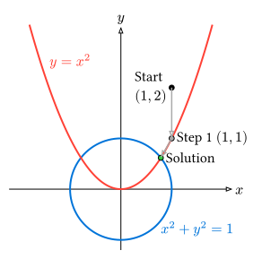

# 多変数ニュートン法

前節では1変数の非線形方程式 $f(x)=0$ を扱いましたが、物理シミュレーションでは複数の変数が相互に依存する連立方程式を解く必要がしばしば生じます。

$$
vb(F)(vb(x)) = vec(
    f_1 (x_1, ..., x_n),
    dots.v,
    f_n (x_1, ..., x_n)
) = vb(0)
$$

これを解くための標準的な手法が、ニュートン法を多変数に拡張した**多変数ニュートン法 (Multivariable Newton's Method)** です。

## アルゴリズム

1変数の場合の更新式 $x_(n+1) = x_n - f(x_n)/(f'(x_n))$ をベクトルと行列に拡張します。

多変数のテイラー展開（1次近似）は以下のようになります。

$$ vb(F)(vb(x) + Delta vb(x)) approx vb(F)(vb(x)) + J(vb(x)) Delta vb(x) = vb(0) $$

ここで $J(vb(x))$ は**ヤコビ行列 (Jacobian Matrix)** です。

$$
J = display(mat(
    pdv(f_1, x_1), dots, pdv(f_1, x_n);
    dots.v, dots.down, dots.v;
    pdv(f_n, x_1), dots, pdv(f_n, x_n)
))
$$

したがって、修正量 $Delta vb(x)$ は以下の連立一次方程式を解くことで求められます。

$$ J(vb(x)) Delta vb(x) = -vb(F)(vb(x)) $$

これを解いて $vb(x)$ を更新します。

$$ vb(x) -> vb(x) + Delta vb(x) $$

## Rustによる実装

円 $x^2 + y^2 = 1$ と放物線 $y = x^2$ の交点を求めてみましょう。

連立方程式は以下のようになります。

$$
cases(
    f_1(x, y) = x^2 + y^2 - 1 = 0,
    f_2(x, y) = y - x^2 = 0
)
$$

ヤコビ行列 $J$ は：

$$
J = mat(
    pdv(f_1, x), pdv(f_1, y);
    pdv(f_2, x), pdv(f_2, y)
) = mat(
    2x, 2y;
    -2x, 1
)
$$



### 計算の具体例 (1ステップ目)

初期値を $(x_0, y_0) = (1.0, 2.0)$ として、1回目の更新を手計算で追ってみましょう。

1. **残差ベクトル $vb(F)(vb(x)_0)$ の計算**
   $$ f_1(1, 2) = 1^2 + 2^2 - 1 = 4 $$
   $$ f_2(1, 2) = 2 - 1^2 = 1 $$
   $$ vb(F)(vb(x)_0) = vec(4, 1) $$

2. **ヤコビ行列 $J(vb(x)_0)$ の計算**
   $$ J(vb(x)_0) = mat(2(1), 2(2); -2(1), 1) = mat(2, 4; -2, 1) $$

3. **修正量 $Delta vb(x)$ の計算**
   連立方程式 $J Delta vb(x) = -vb(F)$ を解きます。
   $$ mat(2, 4; -2, 1) vec(Delta x, Delta y) = vec(-4, -1) $$
   これを解くと（クラメルの公式やガウス消去法などで）、
   $$ Delta x = 0, quad Delta y = -1 $$

4. **解の更新**
   $$ x_1 = x_0 + Delta x = 1.0 + 0.0 = 1.0 $$
   $$ y_1 = y_0 + Delta y = 2.0 + (-1.0) = 1.0 $$

   次の推定値は $(1.0, 1.0)$ となります。これを繰り返すことで、真の解（この場合は $(plus.minus sqrt((sqrt(5)-1)/2), (sqrt(5)-1)/2) approx (plus.minus 0.786, 0.618)$）に近づいていきます。

実装には `ndarray` と `ndarray-linalg` を使用します。

> [!NOTE]
> 実行には `Cargo.toml` に `ndarray` と `ndarray-linalg`、およびバックエンド（例: `openblas-src`）の依存関係が必要です。

```rust,noplayground
use ndarray::{arr1, arr2};
use ndarray_linalg::Solve;

fn main() {
    // 初期値 (x, y) = (1.0, 2.0)
    // 解に近い適切な初期値を選ぶ必要があります
    let mut x = arr1(&[1.0, 2.0]);

    let tolerance = 1e-8;
    let max_iter = 100;

    for i in 0..max_iter {
        // 現在の x, y
        let curr_x: f64 = x[0];
        let curr_y: f64 = x[1];

        // 残差ベクトル F(x)
        let f1 = curr_x.powi(2) + curr_y.powi(2) - 1.0;
        let f2 = curr_y - curr_x.powi(2);
        let f_vec = arr1(&[f1, f2]);

        // 収束判定 (ノルムが十分小さいか)
        if f_vec.iter().map(|v| v.powi(2)).sum::<f64>().sqrt() < tolerance {
            println!("解が見つかりました: x={:.6}, y={:.6} (反復: {})", curr_x, curr_y, i);
            return;
        }

        // ヤコビ行列 J(x)
        let j = arr2(&[
            [2.0 * curr_x, 2.0 * curr_y],
            [-2.0 * curr_x, 1.0       ]
        ]);

        // 連立一次方程式 J * delta_x = -F を解く
        // solve() は ndarray-linalg の機能
        let delta = j.solve(&(-f_vec)).expect("Singular Jacobian");

        // 更新
        x = x + delta;
    }

    println!("収束しませんでした");
}
```

### 解説

1. **ループ**: 1変数のときと同様に、収束するまでループします。
2. **連立一次方程式**: `j.solve(&(-f_vec))` の部分で、線形代数のソルバーが活躍します。ここでは $2 times 2$ の小さな行列ですが、大規模な物理シミュレーションではここの計算コストが支配的になります。
3. **逆行列**: 数式上は $Delta vb(x) = -J^(-1) vb(F)$ と書けますが、**数値計算では逆行列 $J^(-1)$ を明示的に求めてはいけません**。連立方程式 $J Delta vb(x) = -vb(F)$ を解く方が、計算量的にも精度的にも有利だからです。

## 応用例

多変数ニュートン法は以下のような場面で使用されます。

- **陰的解法 (Implicit Methods)**: 時間発展の方程式（微分方程式）を解く際、次の時刻の状態を求めるために非線形方程式を解く必要がある場合（後退オイラー法など）。
- **構造解析**: 大きな変形を伴う物体の釣り合い位置を求める問題。

## まとめ

- **多変数ニュートン法**は、1変数のニュートン法をベクトルと行列に一般化した手法である。
- 各ステップで**ヤコビ行列** $J$ を計算し、連立一次方程式 $J Delta vb(x) = -vb(F)$ を解くことで修正量を求める。
- 逆行列 $J^(-1)$ を計算するのではなく、**LU分解などの線形ソルバー**を用いるのが数値計算の鉄則である。
- この手法は、非線形微分方程式の陰的解法など、物理シミュレーションの多くの場面で利用される。

---

[次節](./optimization.md)では、方程式を解くことと密接に関連する「最適化問題」について扱います。
