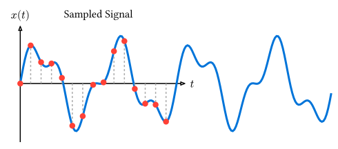

# 離散フーリエ変換の基礎

> [!NOTE]
> **本節のポイント**
>
> - 離散フーリエ変換(DFT)の数学的定義を理解する。
> - `ndarray`を用いて、DFTを定義通りに実装する方法を学ぶ。
> - DFTを行列演算（線形変換）として解釈し、第4章で学んだ知識と結びつける。
> - 直接計算の計算量$O (N^2)$という課題を理解する。

コンピュータで扱うデータは、一定の時間間隔でサンプリングされた離散的な数値の列です。このような離散データに対してフーリエ変換を行う手法を**離散フーリエ変換 (Discrete Fourier Transform, DFT)** と呼びます。



## DFTの定義

長さ$N$の複素数データ系列$vb(x) = (x_0, x_1, ..., x_(N-1))^T$に対して、その離散フーリエ変換$vb(X) = (X_0, X_1, ..., X_(N-1))^T$は次のように定義されます。

$$ X_k = sum_(n=0)^(N-1) x_n exp(- i (2 pi k n) / N) quad (k = 0, 1, ..., N-1) $$

ここで$i$は虚数単位です。$X_k$は、元の信号に含まれる周波数成分（振幅と位相）を表します。

逆に、$vb(X)$から元の信号$vb(x)$を復元する**逆離散フーリエ変換 (IDFT)** は以下の通りです。

$$ x_n = 1/N sum_(k=0)^(N-1) X_k exp(i (2 pi k n) / N) quad (n = 0, 1, ..., N-1) $$

## DFTの実装 (ndarray)

第2章で学んだ`ndarray`を使用して、定義式に基づいてDFTを計算するコードを実装してみましょう。複素数の扱いは`num-complex`クレート（`Complex64`）を使用します。

```toml:Cargo.toml
[dependencies]
ndarray = "0.17"
num-complex = "0.4"
```

```rust,noplayground
use ndarray::{Array1, ArrayView1};
use num_complex::Complex64;
use std::f64::consts::PI;

/// 定義式に基づいたDFTの直接計算
fn dft(x: ArrayView1<Complex64>) -> Array1<Complex64> {
    let n = x.len();
    let mut x_k = Array1::zeros(n);

    for k in 0..n {
        let mut sum = Complex64::new(0.0, 0.0);
        for n_idx in 0..n {
            let angle = -2.0 * PI * (k as f64) * (n_idx as f64) / (n as f64);
            // オイラーの公式 exp(iθ) = cos θ + i sin θ を用いた計算
            let exponent = Complex64::from_polar(1.0, angle);
            sum += x[n_idx] * exponent;
        }
        x_k[k] = sum;
    }
    x_k
}

fn main() {
    // 例：4点のデータ
    let data = Array1::from(vec![
        Complex64::new(1.0, 0.0),
        Complex64::new(2.0, 0.0),
        Complex64::new(3.0, 0.0),
        Complex64::new(4.0, 0.0),
    ]);

    let result = dft(data.view());

    for (k, val) in result.iter().enumerate() {
        println!("X[{}] = {:.3} + {:.3}i", k, val.re, val.im);
    }
}
```

```text
X[0] = 10.000 + 0.000i
X[1] = -2.000 + 2.000i
X[2] = -2.000 + -0.000i
X[3] = -2.000 + -2.000i
```

## 線形代数としての解釈：DFT行列

第4章で学んだように、DFTはベクトルに対する線形変換とみなすことができます。
$W = exp(-i (2 pi)/N)$とおくと、DFTは以下のような行列とベクトルの積で表現できます。

$$
vb(X) =
mat(
W^0, W^0, dots.h, W^0;
W^0, W^1, dots.h, W^(N-1);
dots.v, dots.v, dots.down, dots.v;
W^0, W^(N-1), dots.h, W^((N-1)^2)
)
vb(x)
$$

この行列を **DFT行列** と呼びます。`ndarray`の行列積`dot`を利用すれば、DFTはさらに簡潔に記述可能です。

```rust,noplayground
fn dft_matrix_method(x: &Array1<Complex64>) -> Array1<Complex64> {
    let n = x.len();
    // DFT行列の作成
    let mut w = Array2::<Complex64>::zeros((n, n));
    for k in 0..n {
        for n_idx in 0..n {
            let angle = -2.0 * PI * (k as f64) * (n_idx as f64) / (n as f64);
            w[[k, n_idx]] = Complex64::from_polar(1.0, angle);
        }
    }
    // 行列とベクトルの積
    w.dot(x)
}
```

## 計算量と課題

いずれの実装でも、全ての周波数$k$に対して$N$回の和をとるため、計算量は **$O (N^2)$** となります。

データ数$N$が大きくなると計算時間が爆発的に増加します。

- $N=10^3$のとき、$N^2 = 10^6$回の複素数演算。
- $N=10^6$のとき、$N^2 = 10^(12)$回の複素数演算（一般的なPCでは実用困難）。

この$O (N^2)$の壁を打破し、実用的な速度でフーリエ変換を行う手法が、次節で学ぶ**高速フーリエ変換 (FFT)** です。

---

[次節](./fft.md)では、計算効率を劇的に改善する FFTのアルゴリズムとライブラリの使い方について学びます。
