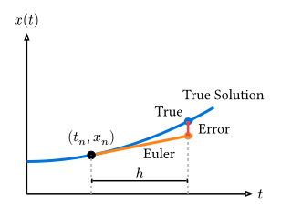

# オイラー法

> [!NOTE]
> **本節のポイント**
>
> - 常微分方程式の最も基本的な解法であるオイラー法の原理を理解する。
> - 1次精度手法の誤差の蓄積（大域誤差）について学ぶ。
> - 2階微分方程式を連立1階微分方程式に帰着させる手法を習得する。

**オイラー法 (Euler's Method)** は、常微分方程式の数値解法の中で最も基本的かつ単純な手法です。実用的な精度は低いものの、微分方程式を数値的に解く（時間発展させる）ための基礎的な概念を理解するために不可欠です。

## 原理

1階の常微分方程式の初期値問題を考えます。

$$ dv(x, t) = f(t, x), quad x(t_0) = x_0 $$

微分の定義により、時間刻み幅$h = Delta t$が十分に小さければ、導関数は前方差分で近似できます。

$$ (x(t + h) - x(t)) / h approx f(t, x(t)) $$

これを$x(t+h)$について解くと、現在の状態$x_n$から次の時刻の状態$x_(n+1)$を求める更新式（漸化式）が得られます。

$$ x_(n+1) = x_n + h f(t_n, x_n) $$

$$ t_(n+1) = t_n + h $$



幾何学的には、「現在の点$(t_n, x_n)$における接線の傾き$f (t_n, x_n)$に沿って、時間$h$だけ直線的に進む」ことを意味します。このため、関数の曲率が大きい場合、ステップを進めるごとに真の解から大きく外れていくことになります。

## 誤差の性質

オイラー法の誤差には、1ステップごとに発生する **局所誤差** と、計算終了までに蓄積される **大域誤差** があります。

- **局所誤差**: テイラー展開を$O (h^2)$の項で打ち切っているため、$O (h^2)$となります。
- **大域誤差**: 計算ステップ数は$T/h$に比例するため、誤差の蓄積により$O (h^2) times (1/h) = O (h)$となります。

このように、全体の誤差が$h$の1乗に比例する手法を **1次精度(First-order accuracy)** と呼びます。刻み幅$h$を半分にしても、誤差は半分にしかなりません。実用的な科学技術計算では、より高次（通常は4次以上）の手法が求められます。

## Rustによる実装

まずは、1変数の微分方程式を解くプログラムを実装してみましょう。
例として、以下の放射性崩壊などを記述する方程式を考えます。
$$ dv(x, t) = -x, quad x(0) = 1 $$

解析解は$x(t) = e^(-t)$です。

```rust
/// オイラー法による1ステップの更新
fn euler_step<F>(x: f64, t: f64, h: f64, f: F) -> f64
where
    F: Fn(f64, f64) -> f64,
{
    x + h * f(t, x)
}

fn main() {
    let f = |_t: f64, x: f64| -x;
    let x0 = 1.0;
    let t_max = 2.0;

    println!(
        "{:<5} {:<15} {:<15} {:<15}",
        "h", "Numerical", "Exact", "Error"
    );
    println!("{}", "-".repeat(55));

    for &h in &[0.4, 0.2, 0.1, 0.05] {
        let mut t = 0.0;
        let mut x = x0;

        while t < t_max {
            x = euler_step(x, t, h, f);
            t += h;
        }

        let exact = (-t_max).exp();
        println!(
            "{:<5.2} {:<15.8} {:<15.8} {:<15.2e}",
            h,
            x,
            exact,
            (x - exact).abs()
        );
    }
}
```

実行結果：

```text
h     Numerical       Exact           Error
-------------------------------------------------------
0.40  0.07776000      0.13533528      5.76e-2
0.20  0.08589935      0.13533528      4.94e-2
0.10  0.12157665      0.13533528      1.38e-2
0.05  0.12851216      0.13533528      6.82e-3
```

$h$を半分にするごとに、誤差もおよそ半分になっていることが確認できます。これが1次精度の特徴です。

## 2階微分方程式への適用（連立化）

ニュートンの運動方程式$F = m a$のような2階微分方程式は、速度$v = dv(x, t)$を導入することで、2つの連立1階微分方程式に書き換えて解くことができます。

$$ dv(x, t, 2) = F(x, v, t) / m $$

$$ arrow.r.double cases(
    dv(x, t) = v,
    dv(v, t) = F(x, v, t) / m
) $$

これをオイラー法で書くと：

$$ x_(n+1) = x_n + h v_n $$

$$ v_(n+1) = v_n + h F(x_n, v_n, t_n) / m $$

一般に、多変数あるいは高階の微分方程式は、状態をベクトル$vb(x) = (x_1, x_2, dots)^T$として扱うことで、単一のベクトル微分方程式$dv(vb(x), t) = vb(f)(t, vb(x))$として統一的に記述できます。これについては次節のルンゲ＝クッタ法で詳しく扱います。

## まとめ

- **オイラー法**は、微分を前方差分で近似する最も単純な解法。
- **1次精度** ($O (h)$)であり、実用的な精度を得るには非常に小さな刻み幅が必要。
- 2階以上の微分方程式は、変数を増やすことで1階の連立方程式に変換できる。

[次節](./runge-kutta.md)では、オイラー法の精度を大幅に改善した**ルンゲ＝クッタ法**を学びます。
