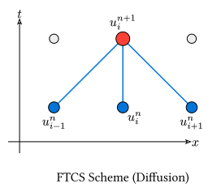

# 拡散方程式

> [!NOTE]
> **本節のポイント**
>
> - 拡散方程式（熱伝導方程式）の物理的意味を理解する。
> - 陽解法（FTCS法）による離散化と、その安定性条件（フォン・ノイマンの安定性解析）を学ぶ。
> - `ndarray`を用いた効率的な空間格子の扱い方を習得する。

熱の伝導や粒子の拡散を記述する**拡散方程式（熱伝導方程式）** を扱います。

$$ pdv(u, t) = D pdv(u, x, 2) $$

ここで$D$は拡散係数です。

## 陽解法 (Explicit Method: FTCS)

最も単純な手法は、時間について前進差分、空間について中心差分を用いる **FTCS (Forward-Time Central-Space)** 法です。

拡散方程式$pdv(u, t) = D pdv(u, x, 2)$に、[前節](finite-difference.md)で学んだ差分近似を代入します。

$$ (u_i^(n+1) - u_i^n) / (Delta t) = D (u_(i+1)^n - 2u_i^n + u_(i-1)^n) / (Delta x^2) $$

これを$u_i^(n+1)$について解くと、現在の時刻$n$の値から次の時刻$n+1$の値を直接計算できる更新式が得られます。

$$ u_i^(n+1) = u_i^n + r (u_(i+1)^n - 2u_i^n + u_(i-1)^n) $$

ここで、$r = D (Delta t)/(Delta x^2)$です。



### 安定性条件

FTCS法が安定であるためには、拡散数$r$が以下の条件を満たす必要があります。

$$ r = D (Delta t)/(Delta x^2) lt.eq 1/2 $$

この条件は、更新式を$u_i^(n+1) = (1 - 2r) u_i^n + r (u_(i+1)^n + u_(i-1)^n)$と書き直すと直感的に理解できます。これは周囲の点との**加重平均**の形をしていますが、$r > 1/2$になると中央の点$u_i^n$の重み$(1-2r)$が負になってしまいます。物理的には「熱が隣へ移動しすぎて、元の場所が周囲より冷たくなってしまう」という不自然な逆転現象が起き、それが増幅されて計算が爆発（発散）するのです。

## 陰解法(Implicit Method)

安定性の制約を回避するために、次の時刻$n+1$の値を用いて微分を近似する**陰解法**が使われます。特に有名なのが **クランク・ニコルソン法(Crank-Nicolson method)** です。

$$ (u_i^(n+1) - u_i^n) / (Delta t) = D/2 [ (pdv(u, x, 2))_i^n + (pdv(u, x, 2))_i^(n+1) ] $$

これは常に安定ですが、各ステップで連立一次方程式を解く必要があります。これについては[第4章](../ch04-linear-algebra/linear-systems.md)で学んだLU分解などの手法が応用できます。

## Rustによる実装 (陽解法)

`ndarray`を用いて、1次元の拡散方程式を解くプログラムを実装してみましょう。

```rust,noplayground
use ndarray::Array1;

fn main() {
    let nx = 50; // 空間分割数
    let nt = 500; // 時間ステップ数
    let dx = 1.0;
    let dt = 0.2;
    let d_coeff = 1.0; // 拡散係数

    let r = d_coeff * dt / (dx * dx);
    println!("拡散数 r = {:.3}", r);

    if r > 0.5 {
        eprintln!("Warning: 安定性条件 (r <= 0.5) を満たしていません！");
    }

    // 初期状態: 中央に熱源がある（デルタ関数的な初期分布）
    let mut u = Array1::<f64>::zeros(nx);
    u[nx / 2] = 100.0;

    // 時間発展ループ
    for n in 0..nt {
        let mut u_next = Array1::<f64>::zeros(nx);

        // 境界を除く内部点を更新 (スライスを用いた並列化も可能)
        for i in 1..nx - 1 {
            u_next[i] = u[i] + r * (u[i + 1] - 2.0 * u[i] + u[i - 1]);
        }

        // 境界条件 (固定境界: ディリクレ条件)
        u_next[0] = 0.0;
        u_next[nx - 1] = 0.0;

        u = u_next;

        // 100ステップごとに中央の値を表示
        if n % 100 == 0 {
            println!("Step {}: u[center] = {:.4}", n, u[nx / 2]);
        }
    }
}
```

```text
拡散数 r = 0.200
Step 0: u[center] = 60.0000
Step 100: u[center] = 6.2727
Step 200: u[center] = 4.4478
Step 300: u[center] = 3.6347
Step 400: u[center] = 3.1458
```

### 結果の解釈

中央の温度（`u[center]`）が、ステップが進むにつれて急速に低下していることが分かります。これは、初期に一点に集中していた熱が周囲へと「拡散」し、分布が平滑化されている物理現象を反映しています。
また、今回は両端の温度を$0$に固定しているため、熱は次第に境界から外部へと逃げていき、十分な時間が経過すれば領域全体の温度は$0$に収束します。計算結果の減衰速度が後半になるほど緩やかになるのは、温度勾配が小さくなるにつれて拡散のドライビングフォースが弱まるためです。

## まとめ

- **拡散方程式** は、時間1階・空間2階の偏微分方程式。
- **FTCS法（陽解法）** は実装が容易だが、安定性条件$r lt.eq 1/2$という厳しい制約がある。
- **陰解法** を用いると無条件安定になるが、計算コスト（連立一次方程式の求解）が増大する。

---

[次節](./wave.md)では、波の伝播を扱う波動方程式について学びます。
