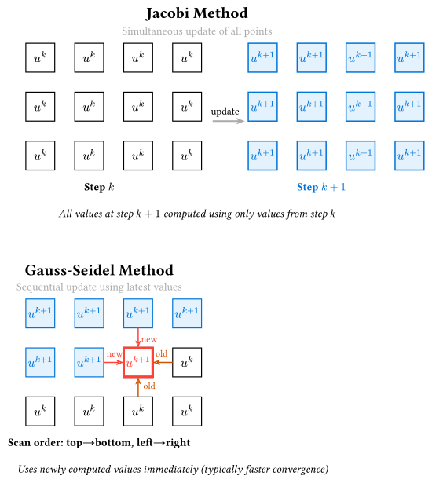

# 楕円型方程式

> [!NOTE]
> **本節のポイント**
>
> - 静的な場の分布を記述する楕円型方程式（ポアソン方程式・ラプラス方程式）の性質を学ぶ。
> - 境界値問題としての解法である「反復法」の原理を理解する。
> - ヤコビ法、ガウス＝ザイデル法、SOR法の違いを学ぶ。
> - `ndarray::Array2`を用いた2次元格子の効率的な扱い方を習得する。

静的な電位分布や定常的な温度分布を記述する、時間に依存しない方程式を扱います。

- **ラプラス方程式**: $nabla^2 phi = 0$
- **ポアソン方程式**: $nabla^2 phi = f$

2次元のポアソン方程式は以下の通りです。

$$ pdv(phi, x, 2) + pdv(phi, y, 2) = f(x, y) $$

## 離散化の導出

2次元のポアソン方程式$pdv(phi, x, 2) + pdv(phi, y, 2) = f(x, y)$を考えます。空間刻みを$Delta x = Delta y = h$として、中心差分による近似を代入します。

$$ (phi_(i+1,j) - 2phi_(i,j) + phi_(i-1,j)) / h^2 + (phi_(i,j+1) - 2phi_(i,j) + phi_(i,j-1)) / h^2 = f_(i,j) $$

分子を整理すると：

$$ phi_(i+1,j) + phi_(i-1,j) + phi_(i,j+1) + phi_(i,j-1) - 4phi_(i,j) = h^2 f_(i,j) $$

これを$phi_(i,j)$について解くと、格子点$(i, j)$における値が周囲4点の平均（および源$f$）で表されることがわかります。

$$ phi_(i,j) = 1/4 (phi_(i+1,j) + phi_(i-1,j) + phi_(i,j+1) + phi_(i,j-1) - h^2 f_(i,j)) $$

ラプラス方程式（$f=0$）の場合、これは **「ある点での値は、その周囲の平均値に等しい」** という調和関数の性質をそのまま離散化したものに対応します。

## 反復法による解法

楕円型方程式は領域全体の境界条件によって解が決まるため、時間発展のように端から順番に計算することはできません。通常は、適当な初期推定値から始めて、上の関係式を満たすように値を修正していく**反復法** が用いられます。



### 1. ヤコビ法(Jacobi Method)

古いステップ$k$の値をすべて使って、新しいステップ$k+1$の値を一斉に計算します。
$$ phi_(i,j)^(k+1) = 1/4 (phi_(i+1,j)^k + phi_(i-1,j)^k + phi_(i,j+1)^k + phi_(i,j-1)^k - h^2 f_(i,j)) $$

プログラム上では、新旧2つの配列を用意する必要があります。収束は非常に低速です。

### 2. ガウス＝ザイデル法(Gauss-Seidel Method)

計算が完了したばかりの最新の$k+1$の値を、同じステップ内の後半の計算で直ちに利用します。
$$ phi_(i,j)^(k+1) = 1/4 (phi_(i+1,j)^k + phi_(i-1,j)^(k+1) + phi_(i,j+1)^k + phi_(i,j-1)^(k+1) - h^2 f_(i,j)) $$

ヤコビ法よりも収束が速く、配列も1つで済むためメモリ効率が良いのが特徴です。

### 3. SOR法(Successive Over-Relaxation)

ガウス＝ザイデル法で求まる修正量をさらに強調（オーバーリラクゼーション）させる手法です。
ガウス＝ザイデル法による新しい値を$phi_("GS")$とすると、実際の更新値を以下のように決めます。
$$ phi_(i,j)^(k+1) = (1 - omega) phi_(i,j)^k + omega phi_("GS") $$

ここで$omega$は加速パラメータです。

- $omega = 1$: ガウス＝ザイデル法と同じ。
- $1 < omega < 2$: 収束を加速させます（目標値へ向かう変化を「追い越す」ように多めに修正する）。

適切な$omega$（通常$1.7$ 〜 $1.9$程度）を選ぶことで、収束までの反復回数を劇的に減らすことができます。

## Rustによる実装（ガウス＝ザイデル法）

`ndarray::Array2`を用いて、2次元正方形領域におけるラプラス方程式$nabla^2 phi = 0$を解きます。
境界条件として、上辺を$100$、それ以外を$0$とします（ディリクレ問題）。

```rust,noplayground
use ndarray::Array2;

fn main() {
    let n = 50; // グリッドサイズ 50x50
    let max_iter = 10000;
    let tolerance = 1e-4; // 収束判定の閾値

    // 2次元グリッドの初期化 (0.0)
    let mut phi = Array2::<f64>::zeros((n, n));

    // 境界条件の設定
    // 上辺 (y=0) を 100.0 に固定
    for x in 0..n {
        phi[[0, x]] = 100.0;
    }
    // 左辺、右辺、下辺は 0.0 のまま

    for iter in 0..max_iter {
        let mut max_diff = 0.0;

        // グリッド内部の更新 (y, x)
        for y in 1..n - 1 {
            for x in 1..n - 1 {
                let old_val = phi[[y, x]];

                // ガウス＝ザイデル法: 最新の値をそのまま使って更新
                let new_val =
                    0.25 * (phi[[y, x + 1]] + phi[[y, x - 1]] + phi[[y + 1, x]] + phi[[y - 1, x]]);

                phi[[y, x]] = new_val;

                let diff = (new_val - old_val).abs();
                if diff > max_diff {
                    max_diff = diff;
                }
            }
        }

        // 収束判定
        if max_diff < tolerance {
            println!("収束しました: 反復回数 {}", iter + 1);
            break;
        }

        if iter % 500 == 0 {
            println!("Iter {}: max_diff = {:.6}", iter, max_diff);
        }
    }

    // 結果の確認（中心付近の値）
    println!("phi[25, 25] = {:.2}", phi[[n / 2, n / 2]]);
}
```

```text
Iter 0: max_diff = 33.333333
Iter 500: max_diff = 0.020671
Iter 1000: max_diff = 0.002597
Iter 1500: max_diff = 0.000332
収束しました: 反復回数 1793
phi[25, 25] = 24.12
```

### 結果の解釈

反復が進むにつれて、最大の変化量（`max_diff`）が着実に減少していることが分かります。これは、初期の適当な推定値が、周囲の格子点との平均関係を満たす「滑らかな解（調和関数）」へと一歩ずつ近づいているプロセスを表しています。
最終的に得られた`phi[25, 25] = 24.12`という値は、上辺($100$)からのポテンシャルが領域内部へと浸透し、他の三辺($0$)との境界条件を満たしながら定常状態に達した結果です。ラプラス方程式の解は「極大・極小を領域の内部に持たず、常に境界に依存する」という性質を持っていますが、この数値解もその物理的特徴を正しく再現しています。

## まとめ

- **楕円型方程式**は時間に依存しない定常状態を記述し、境界条件によって領域全体の解が決定される。
- **反復法**を用いることで、離散化された代数方程式を数値的に解くことができる。
- **ガウス＝ザイデル法**や**SOR法**は、ヤコビ法に比べて収束速度とメモリ効率の面で優れている。

---

第8章はこれで終わりです。次は[第9章: モンテカルロ法](../ch09-monte-carlo/)に進みましょう。
