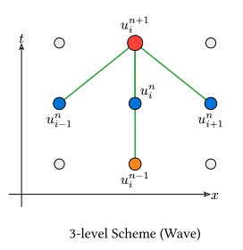

# 波動方程式

> [!NOTE]
> **本節のポイント**
>
> - 時間2階微分を含む波動方程式の離散化手法を理解する。
> - 3つの時刻（過去・現在・未来）を保持するバッファの管理方法を学ぶ。
> - 初期速度条件を考慮した最初のステップの計算方法を習得する。
> - CFL条件による安定性の制約を確認する。

波の伝搬（弦の振動、音波、電磁波など）を記述する**波動方程式**を扱います。

$$ pdv(u, t, 2) = v^2 pdv(u, x, 2) $$

ここで$v$は波の伝播速度です。拡散方程式とは異なり、時間に2階微分が含まれていることが大きな特徴です。

## 離散化

時間、空間ともに中心差分を用います。

$$ (u_i^(n+1) - 2u_i^n + u_i^(n-1)) / (Delta t^2) = v^2 (u_(i+1)^n - 2u_i^n + u_(i-1)^n) / (Delta x^2) $$

これを $u_i^(n+1)$ について解くと：

$$ u_i^(n+1) = 2u_i^n - u_i^(n-1) + C^2 (u_(i+1)^n - 2u_i^n + u_(i-1)^n) $$

ここで $C = v (Delta t)/(Delta x)$ はクーラン数です。



この式からわかるように、次の時刻の状態$n+1$を決めるには、**現在($n$)と1つ前($n-1$)の2つの時刻の情報**が必要です。

## 初期条件と最初のステップ

2階微分方程式なので、初期状態として位置$u(x, 0)$だけでなく、初期速度$V(x) = pdv(u, t)(x, 0)$も必要です。

最初のステップ($n=1$)を計算する際、更新式には$u_i^(-1)$という仮想的な過去の値が必要になります。これを初期速度$V_i$を用いた中心差分から推定します。

$$ (u_i^1 - u_i^(-1)) / (2 Delta t) = V_i arrow.r u_i^(-1) = u_i^1 - 2 Delta t V_i $$

これを時刻$n=0$における更新式に代入すると：

$$ u_i^1 = 2u_i^0 - (u_i^1 - 2 Delta t V_i) + C^2 (u_(i+1)^0 - 2u_i^0 + u_(i-1)^0) $$

$$ 2u_i^1 = 2u_i^0 + 2 Delta t V_i + C^2 (u_(i+1)^0 - 2u_i^0 + u_(i-1)^0) $$

$$ arrow.r u_i^1 = u_i^0 + Delta t V_i + 1/2 C^2 (u_(i+1)^0 - 2u_i^0 + u_(i-1)^0) $$

これが最初のステップ専用の更新式です。初期速度$V_i = 0$の場合は、第2項が消えてさらにシンプルになります。

## 安定性条件(CFL条件)

波動の数値計算においては、[前節](diffusion.md)でも触れたCFL条件が重要です。

$$ C = v (Delta t)/(Delta x) lt.eq 1 $$

これが満たされない場合、波が不自然に増幅されて発散します。

### なぜ不安定になるのか？

この条件は、**「情報の伝わる速さ」** の観点から直感的に理解できます。

1. **物理的な速さ**: 物理現象として波が伝わる速さは$v$です。1ステップ（$Delta t$）の間に、波は$v Delta t$だけ進みます。
2. **計算上の速さ**: 一方、この差分スキームにおいて情報が伝わる速さは$(Delta x)/(Delta t)$です（1ステップで隣の格子点$Delta x$までしか情報が伝わらない）。

もし$C > 1$（つまり$v > (Delta x)/(Delta t)$）になると、物理的な波のスピードが計算格子の上で情報が伝わるスピードを追い越してしまいます。数値計算が物理現象の進展に追いつけなくなり、計算格子が「本来あるはずの波の姿」を正しく表現できず、数値的な誤差が指数関数的に増大して爆発（発散）を引き起こすのです。

幾何学的には、点 $(x_i, t_(n+1))$ の**物理的な依存領域**（その点に影響を与えうる過去の範囲）が、スキームの**数値的な依存領域**（計算に使用する格子点の範囲）の外側にはみ出してしまうことに対応します。

## Rustによる実装

両端固定の弦の振動をシミュレーションする例です。`ndarray::Array1`を用いて、3つの時間ステップを管理します。

```rust,noplayground
use ndarray::Array1;

fn main() {
    let nx = 100;
    let nt = 300;
    let dx = 0.1;
    let dt = 0.05;
    let v = 1.0; // 波の速度

    // CFL条件のチェック
    let c = v * dt / dx;
    println!("CFL数 = {:.3}", c);
    if c > 1.0 {
        eprintln!("Warning: 不安定な条件 (CFL > 1) です！");
    }

    // 3つの時間ステップを保持
    let mut u_prev = Array1::<f64>::zeros(nx); // u^(n-1)
    let mut u_curr = Array1::<f64>::zeros(nx); // u^n
    let mut u_next = Array1::<f64>::zeros(nx); // u^(n+1)

    // 1. 初期条件の設定 (t=0)
    // ガウス波束を中心に配置
    let center = (nx / 2) as f64 * dx;
    let sigma = 1.0_f64;
    for i in 0..nx {
        let x = i as f64 * dx;
        u_curr[i] = (-(x - center).powi(2) / (2.0 * sigma.powi(2))).exp();
    }

    // 2. 最初のステップ (n=1) の計算
    // 初期速度 0 と仮定
    let c2 = c * c;
    for i in 1..nx - 1 {
        u_next[i] = u_curr[i] + 0.5 * c2 * (u_curr[i + 1] - 2.0 * u_curr[i] + u_curr[i - 1]);
    }
    // 境界条件 (固定端)
    u_next[0] = 0.0;
    u_next[nx - 1] = 0.0;

    // バッファの更新
    u_prev.assign(&u_curr);
    u_curr.assign(&u_next);

    // 3. 時間発展ループ (n=2, 3, ...)
    for n in 2..nt {
        for i in 1..nx - 1 {
            u_next[i] = 2.0 * u_curr[i] - u_prev[i]
                + c2 * (u_curr[i + 1] - 2.0 * u_curr[i] + u_curr[i - 1]);
        }

        // 境界条件
        u_next[0] = 0.0;
        u_next[nx - 1] = 0.0;

        if n % 50 == 0 {
            println!("Step {}: u[center] = {:.4}", n, u_next[nx / 2]);
        }

        // バッファの更新 (値をコピーせずに代入したい場合は工夫が必要だが、ここでは単純に)
        u_prev.assign(&u_curr);
        u_curr.assign(&u_next);
    }
}
```

```text
CFL数 = 0.500
Step 50: u[center] = 0.0437
Step 100: u[center] = -0.0000
Step 150: u[center] = -0.0583
Step 200: u[center] = -0.9909
Step 250: u[center] = -0.0337
```

### 結果の解釈

中央の変位（`u[center]`）が、時間の経過とともに正から負へと大きく変動していることが分かります。これは、中央から始まった波のパルスが両端（固定端）で反射し、戻ってきて再び中央で重なり合う往復運動を再現しています。
拡散方程式の結果と比較すると、値が一方的に小さくなるのではなく、変位が維持されながら周期的に変化している点が大きな違いです。これは、波動方程式がエネルギーを散逸させずに伝播・保持する物理的性質を、数値計算が正しく捉えていることを示しています。

## まとめ

- **波動方程式**は、時間2階・空間2階の偏微分方程式であり、情報の伝播を記述する。
- 数値解法には、過去・現在・未来の**3つの時刻の格子点データ**が必要。
- **初期速度条件**を適切に処理するために、最初の1ステップ目は特別な更新式を用いる。
- 安定性のためには **CFL条件($C lt.eq 1$)** を厳守する必要がある。

---

[次節](./elliptic.md)では、静的な場の分布を求める楕円型方程式について学びます。
