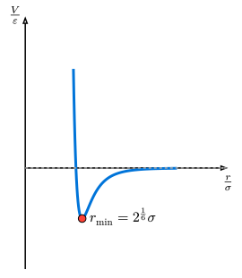

# 分子動力学シミュレーション

これまでの知識を総動員して、**分子動力学法 (Molecular Dynamics, MD)** のシミュレーションを構築しましょう。
MDは、原子や分子の動きをニュートンの運動方程式に従って計算し、物質の巨視的な性質（温度、圧力、相転移など）を微視的な視点から解析する強力な手法です。

## レナード・ジョーンズ・ポテンシャル

希ガス（アルゴンなど）の原子間相互作用を記述する最も代表的なモデルが、**レナード・ジョーンズ (Lennard-Jones, LJ) ポテンシャル**です。

$$ V(r) = 4 epsilon [ (sigma/r)^12 - (sigma/r)^6 ] $$



このポテンシャルは、2つの物理的効果を組み合わせています：

1. **遠距離の引力 ($r^(-6)$項)**: 分子間の「ファンデルワールス力（分散力）」を表します。
2. **近距離の反発 ($r^(-12)$項)**: 電子雲の重なりによる「パウリの排他律」に由来する強い反発力を表します。

ポテンシャルが最小（最も安定）となる距離は$r_min = 2^(1/6) sigma$です。

## 初期条件：格子配置と温度

MDシミュレーションを始めるには、粒子の「初期位置」と「初期速度」を決める必要があります。

1. **初期位置**: 粒子が重なりすぎないよう、正方格子状などに並べるのが一般的です。
2. **初期速度**: 粒子を静止状態で始めると、力が釣り合って動かないか、非常に退屈なシミュレーションになります。物理的には、物質の「温度」は粒子の「熱運動（運動エネルギー）」に対応します。そのため、各粒子にランダムな初速を与えることで、系に特定の温度を導入します。

## 実践的な実装

```rust,noplayground
use ndarray::{Array1, Array2, Axis};
use ndarray_rand::RandomExt;
use ndarray_rand::rand_distr::Uniform;

struct MDSystem {
    n: usize,
    l: f64,
    pos: Array2<f64>,
    vel: Array2<f64>,
    acc: Array2<f64>,
}

impl MDSystem {
    fn new(n: usize, l: f64, target_temp: f64) -> Self {
        let mut pos = Array2::zeros((n, 2));
        let n_side = (n as f64).sqrt() as usize;
        let spacing = l / n_side as f64;

        for i in 0..n {
            pos[[i, 0]] = (i % n_side) as f64 * spacing + spacing * 0.5;
            pos[[i, 1]] = (i / n_side) as f64 * spacing + spacing * 0.5;
        }

        // 1. ランダムな初速を与える（-0.5 ～ 0.5 の一様分布）
        let mut vel = Array2::<f64>::random((n, 2), Uniform::new(-0.5, 0.5));

        // 2. 重心速度をゼロにする（系全体のドリフトを防ぐ）
        let mean_vel = vel.mean_axis(Axis(0)).unwrap();
        vel -= &mean_vel;

        // 3. 温度（運動エネルギー）の調整
        // 2次元の場合、自由度あたりのエネルギーから温度をスケーリング
        let current_temp = 0.5 * vel.mapv(|v: f64| v.powi(2)).sum() / n as f64;
        let scale = (target_temp / current_temp).sqrt();
        vel *= scale;

        Self { n, l, pos, vel, acc: Array2::zeros((n, 2)) }
    }

    fn get_dr(&self, i: usize, j: usize) -> Array1<f64> {
        let mut dr = &self.pos.row(i) - &self.pos.row(j);
        for k in 0..2 {
            if dr[k] > self.l * 0.5 { dr[k] -= self.l; }
            else if dr[k] < -self.l * 0.5 { dr[k] += self.l; }
        }
        dr
    }

    fn compute_forces(&mut self) -> f64 {
        self.acc.fill(0.0);
        let mut pot = 0.0;
        for i in 0..self.n {
            for j in (i + 1)..self.n {
                let dr = self.get_dr(i, j);
                let r2 = dr.dot(&dr);
                if r2 < 9.0 { // カットオフ 3.0
                    let r2_inv = 1.0 / r2;
                    let r6_inv = r2_inv * r2_inv * r2_inv;
                    pot += 4.0 * (r6_inv * r6_inv - r6_inv);
                    let f_scalar = 24.0 * r2_inv * (2.0 * r6_inv * r6_inv - r6_inv);
                    for k in 0..2 {
                        self.acc[[i, k]] += f_scalar * dr[k];
                        self.acc[[j, k]] -= f_scalar * dr[k];
                    }
                }
            }
        }
        pot
    }

    fn step(&mut self, dt: f64) -> f64 {
        self.pos += &(&self.vel * dt + 0.5 * &self.acc * dt * dt);
        self.pos.mapv_inplace(|x| x.rem_euclid(self.l));
        let old_acc = self.acc.clone();
        let pot = self.compute_forces();
        self.vel += &(0.5 * (&old_acc + &self.acc) * dt);
        pot
    }
}

fn main() {
    // 16粒子、サイズ10.0の箱、温度0.5で初期化
    let mut system = MDSystem::new(16, 10.0, 0.5);
    let dt = 0.01;
    system.compute_forces();

    println!("Step, Potential, Kinetic, Total");
    for i in 0..101 {
        let pot = system.step(dt);
        let kin = 0.5 * system.vel.mapv(|v| v.powi(2)).sum();
        if i % 10 == 0 {
            println!("{:>4}, {:>10.4}, {:>10.4}, {:>10.4}", i, pot, kin, pot + kin);
        }
    }
}
```


## パフォーマンスと並列化

粒子数$N$が増えると、力計算の二重ループがボトルネックとなります（計算量$O(N^2)$）。
これを解決するためには、[第14章](../ch14-parallel/rayon.md)で学ぶ`Rayon`を用いた並列計算や、計算量を$O(N)$に抑える**近接リスト法**などの工夫が必要になります。

## まとめ

本章では、単純な落体から多数の粒子系まで、古典力学のシミュレーション手法を学びました。
特に**シンプレクティック積分**の重要性と、`ndarray`を用いたベクトル演算の実装方法は、物理シミュレーション全般に応用できる極めて重要なテクニックです。
[次章](../ch11-fluid-dynamics/)では、これらをさらに発展させ、連続体の力学である「流体力学」について学びます。
