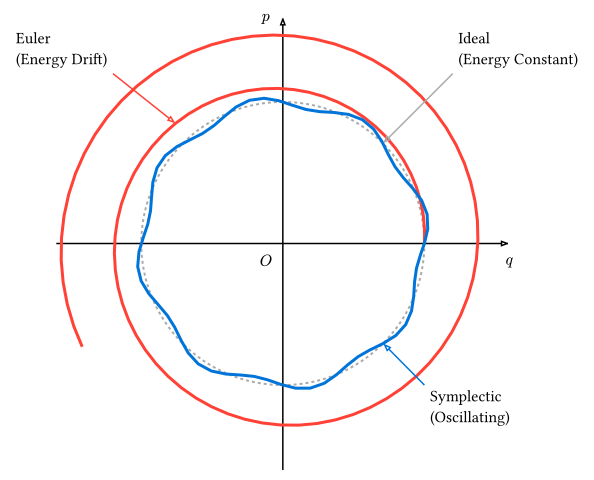

# シンプレクティック積分

[第7章](../ch07-ode/)で学んだルンゲ＝クッタ法（RK4）は非常に高精度ですが、天体の軌道計算や分子動力学シミュレーションのように「エネルギー保存則が成り立つ系（ハミルトン系）」を長時間計算する場合、**エネルギーが徐々に保存されなくなる**という問題があります。

本節では、ハミルトン系の幾何学的構造（シンプレクティック構造）を保存するように設計された**シンプレクティック積分法**について学びます。

## なぜ標準的な手法ではダメなのか？

標準的な手法（オイラー法やルンゲ＝クッタ法）は、解を$Delta t$の多項式で近似することに主眼を置いています。しかし、これらは位相空間（位置$q$と運動量$p$の空間）における面積保存（リウヴィルの定理）を必ずしも満たしません。

結果として、例えば調和振動子の計算において：

- **前進オイラー法**：エネルギーが指数関数的に増大し、軌道が外側に螺旋を描く。
- **ルンゲ＝クッタ法 (RK4)**：エネルギー誤差は非常に小さいが、長時間計算では単調に減衰（あるいは増大）し続け、元に戻らない。



## オイラー・クローマー法

最も単純なシンプレクティック積分は、**オイラー・クローマー法 (Euler-Cromer method)** です。

**オイラー・クローマー法（1次精度）:**
$$ vb(v)_(n+1) = vb(v)_n + vb(a)(vb(x)_n) Delta t $$

（先に速度を更新）
$$ vb(x)_(n+1) = vb(x)_n + vb(v)_(n+1) Delta t $$

（**更新後の速度**を使って位置を更新）

たったこれだけの変更ですが、この手法は位相空間上の面積を保存し、エネルギーが平均的に一定値を保つようになります。

## 速度ベレ法 (Velocity Verlet)

分子動力学などで最も広く使われるのが**速度ベレ法 (Velocity Verlet method)** です。これは2次精度であり、時間反転対称性を持ちます。

位置を更新：
$$ vb(x)_(n+1) = vb(x)_n + vb(v)_n Delta t + 1/2 vb(a)_n (Delta t)^2 $$

新しい位置での加速度$vb(a)_(n+1)$を計算。

速度を更新：
$$ vb(v)_(n+1) = vb(v)_n + (vb(a)_n + vb(a)_(n+1))/2 Delta t $$

### 2次精度の導出

速度ベレ法の精度は、位置 $vb(x)(t + Delta t)$ のテイラー展開を考えることで導かれます。

$$ vb(x)(t + Delta t) = vb(x)(t) + vb(v)(t) Delta t + 1/2 vb(a)(t) Delta t^2 + 1/6 dot(vb(a))(t) Delta t^3 + O(Delta t^4) $$

速度ベレ法の位置の更新式は、このテイラー展開の $Delta t^2$ の項までを厳密に含んでいます。したがって、1ステップあたりの局所誤差は $O(Delta t^3)$ となり、累積される全誤差は $O(Delta t^2)$ の**2次精度**となります。

また、速度の更新式は $t$ と $t+Delta t$ における加速度の平均を用いる「台形公式」の形をしており、これも2次精度を支えています。

### Rustによる実装とエネルギー監視

調和振動子（$F = -x, m = 1$）を例に、エネルギーの保存性を確認できるコードを実装します。

```rust,noplayground
use ndarray::{Array1, arr1};

struct Particle {
    pos: Array1<f64>,
    vel: Array1<f64>,
}

impl Particle {
    fn new(x: f64, v: f64) -> Self {
        Self { pos: arr1(&[x]), vel: arr1(&[v]) }
    }

    // 全エネルギー E = 1/2 v^2 + 1/2 x^2
    fn energy(&self) -> f64 {
        0.5 * (self.vel[0].powi(2) + self.pos[0].powi(2))
    }
}

fn get_acceleration(pos: &Array1<f64>) -> Array1<f64> {
    -pos // 復元力 F = -x
}

fn velocity_verlet_step(p: &mut Particle, dt: f64) {
    let a_curr = get_acceleration(&p.pos);

    // 1. 位置の更新: x(t+dt) = x(t) + v(t)dt + 0.5*a(t)dt^2
    p.pos += &(&p.vel * dt + 0.5 * &a_curr * dt * dt);

    // 2. 新しい位置での加速度 a(t+dt)
    let a_next = get_acceleration(&p.pos);

    // 3. 速度の更新: v(t+dt) = v(t) + 0.5*(a(t) + a(t+dt))dt
    p.vel += &(0.5 * (&a_curr + &a_next) * dt);
}

fn main() {
    let mut p = Particle::new(1.0, 0.0);
    let dt = 0.1;

    println!("Time, Position, Energy");
    for i in 0..101 {
        let t = i as f64 * dt;
        if i % 10 == 0 {
            println!("{:.1}, {:.4}, {:.6}", t, p.pos[0], p.energy());
        }
        velocity_verlet_step(&mut p, dt);
    }
}
```


## 高次のシンプレクティック積分

4次精度が必要な場合、RK4の代わりに**フォレスト＝ルース (Forest-Ruth) の4次シンプレクティック積分** などを用いることができます。これは、1ステップを複数のサブステップに分割し、特定の係数$w_i$を用いて更新を繰り返す手法です。

$$ w_0 = -root(3, 2) / (2 - root(3, 2)), quad w_1 = 1 / (2 - root(3, 2)) $$

のように係数を定めることで、シンプレクティック性を保ったまま4次精度を達成できます。

## なぜシンプレクティック積分はエネルギーを保存するのか？

厳密には、シンプレクティック積分が保存するのは元のハミルトニアン $H$ そのものではなく、それに非常に近い **「影のハミルトニアン (Shadow Hamiltonian)$tilde(H)$」** です。なぜこのような性質が生まれるのか、その理由を幾何学的に説明します。

### 1. 位相空間の面積保存

ハミルトン力学において、時間発展は位相空間 $(q, p)$ 上の**面積（正確にはシンプレクティック形式）を保存する写像**であることが知られています。

オイラー・クローマー法の1ステップ $(q_n, p_n) arrow.r (q_(n+1), p_(n+1))$ のヤコビ行列 $M$ を計算してみると：

$$
cases(
  p_(n+1) = p_n - (pdv(V, q)) Delta t,
  q_(n+1) = q_n + p_(n+1) Delta t
)
$$

この写像のヤコビ行列の行列式は $det(M) = 1$ となります。これは、この数値スキームが**位相空間の体積を厳密に保存している**ことを意味します。一方、標準的なオイラー法では $det(M) = 1 + O(Delta t^2)$ となり、ステップごとに体積が膨張（または収縮）してしまいます。

### 2. 後退誤差解析と影のハミルトニアン

「面積を保存する離散的な写像」は、ある**別のハミルトン系の厳密な解**として解釈できるという定理があります。

つまり、私たちがシンプレクティック積分で解いているのは、元の系 $H$ ではなく、
$$ tilde(H) = H + Delta t H_1 + Delta t^2 H_2 + dots $$

という、時間刻み $Delta t$ に依存する「少しだけずれた系」の厳密な解なのです。

- この $tilde(H)$ は数値計算中、**マシン精度（浮動小数点の丸め誤差）を除いて厳密に保存**されます。
- 真のエネルギー $H$ は、この保存量 $tilde(H)$ の周りを $O(Delta t^k)$ の幅で振動し続けるため、長時間経過しても誤差が累積（ドリフト）することはありません。

これが、シンプレクティック積分が「エネルギーを保存する」と言われる理由の幾何学的な正体です。
