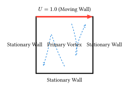
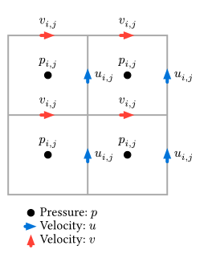

# 差分法による流体シミュレーション

ここでは、非圧縮性流体の数値シミュレーションにおける古典的かつ基本的な手法である **MAC法 (Marker-and-Cell method)** の考え方に基づき、差分法を用いてナビエ＝ストークス方程式を解く方法を学びます。

例題として、正方形の容器の上壁が一定速度で動く「キャビティ流れ（Cavity Flow）」を扱います。



## スタガード格子 (Staggered Grid)

流体計算では、圧力と速度を同じ位置で定義すると、圧力が市松模様に振動してしまう（チェッカーボード不安定性）という問題が知られています。
これを防ぐために、圧力 $p$ をセルの中心に、流速 $u, v$ をセルの界面（中心から半歩ずれた位置）に配置する**スタガード格子**が用いられます。



- $p_(i, j)$: 格子点 $(i, j)$ の中心
- $u_(i, j)$: 格子点 $(i, j)$ と $(i+1, j)$ の間の右側の壁
- $v_(i, j)$: 格子点 $(i, j)$ と $(i, j+1)$ の間の上側の壁

## アルゴリズムの概要（簡易MAC法）

時間ステップごとに以下の処理を行います。

1. **仮の速度の計算**:
   現在の速度場 $vb(u)^n$ を用いて、粘性項と移流項のみを考慮し、仮の速度 $vb(u)^(*)$ を計算します（オイラー法などの時間積分）。

   $$ vb(u)^(*) = vb(u)^n + Delta t [ - (vb(u)^n dot nabla) vb(u)^n + nu nabla^2 vb(u)^n ] $$

2. **圧力のポアソン方程式を解く**:
   連続の式 $div(vb(u)^(n+1)) = 0$ を満たすように圧力 $p$ を決定します。

   $$ nabla^2 p = rho / (Delta t) div(vb(u)^(*)) $$

   これをSOR法（逐次過緩和法）などで反復計算して解きます。

3. **速度の修正**:
   求めた圧力勾配を使って、仮の速度を修正し、次のステップの速度 $vb(u)^(n+1)$ とします。

   $$ vb(u)^(n+1) = vb(u)^(*) - (Delta t) / rho nabla p $$

## Rustによる実装例

簡略化のため、ここではスタガード格子ではなく、通常の格子（Collocated Grid）を用いた実装例を示します（※本格的な計算にはスタガード格子が推奨されます）。

```rust
use ndarray::{Array2, s, Zip};

const N: usize = 50;  // 格子数
const DT: f64 = 0.01; // 時間刻み
const NU: f64 = 0.1;  // 動粘性係数
const RHO: f64 = 1.0; // 密度

struct FluidSolver {
    u: Array2<f64>,
    v: Array2<f64>,
    p: Array2<f64>,
}

impl FluidSolver {
    fn new() -> Self {
        Self {
            u: Array2::zeros((N, N)),
            v: Array2::zeros((N, N)),
            p: Array2::zeros((N, N)),
        }
    }
    
    // 境界条件の設定（上壁が右へ移動）
    fn apply_boundary_conditions(&mut self) {
        // 壁面での滑りなし条件
        self.u.slice_mut(s![0, ..]).fill(0.0); // 下
        self.u.slice_mut(s![N-1, ..]).fill(1.0); // 上 (駆動)
        self.u.slice_mut(s![.., 0]).fill(0.0); // 左
        self.u.slice_mut(s![.., N-1]).fill(0.0); // 右

        self.v.slice_mut(s![0, ..]).fill(0.0);
        self.v.slice_mut(s![N-1, ..]).fill(0.0);
        self.v.slice_mut(s![.., 0]).fill(0.0);
        self.v.slice_mut(s![.., N-1]).fill(0.0);
    }
    
    // 圧力ポアソン方程式を解く (ヤコビ法)
    fn solve_pressure(&mut self) {
        let mut p_next = self.p.clone();
        
        // ソース項 b の計算 (div u*)
        // ... (省略: 中心差分による計算) ...
        
        // 反復計算
        for _ in 0..50 {
            // p(i,j) = 0.25 * (p(i+1,j) + p(i-1,j) + p(i,j+1) + p(i,j-1) - b)
            // ndarrayのZipやスライス操作を使うと効率的
            // ...
        }
    }
    
    fn step(&mut self) {
        // 1. 仮速度の計算（移流項 + 粘性項）
        // 2. 圧力ポアソン方程式の求解
        self.solve_pressure();
        // 3. 速度修正（圧力勾配項）
        // 4. 境界条件適用
        self.apply_boundary_conditions();
    }
}
```

（※完全なコードは長くなるため、主要な構造のみを示しています。実際の計算には、移流項の風上差分化などの安定化手法が必要になります。）

このシミュレーションを実行すると、容器の中心に大きな渦（一次渦）が発生し、四隅に小さな渦（二次渦）ができる様子が観察できます。
流体のシミュレーションは計算量が非常に多いため、Rustの高速性が大いに活きる分野です。
