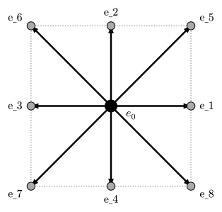

# 格子ボルツマン法 (LBM)

**格子ボルツマン法 (Lattice Boltzmann Method, LBM)** は、流体を連続体としてではなく、離散的な速度を持つ仮想粒子の集合体としてモデル化する手法です。
ナビエ＝ストークス方程式を直接解くのではなく、ボルツマン方程式を簡略化したモデルを解くことで、巨視的には流体として振る舞う結果を得ます。

## 基本概念

### 分布関数 $f_i(vb(x), t)$

位置 $vb(x)$、時刻 $t$ において、離散速度 $vb(e)_i$ で移動している粒子の密度（確率分布）を表します。

### D2Q9モデル

2次元シミュレーションで最も一般的なモデルです。
各格子点において、粒子は以下の9方向のいずれかの速度を持ちます。



- 中心（静止）: 1つ
- 上下左右（近傍）: 4つ
- 斜め（次近傍）: 4つ

### LBGK方程式

時間発展は「衝突」と「並進（ストリーミング）」の2段階で記述されます。

$ f_i(vb(x) + vb(e)_i Delta t, t + Delta t) = f_i(vb(x), t) - 1/tau [ f_i(vb(x), t) - f_i^(eq)(vb(x), t) ] $

右辺第2項はBGK衝突項と呼ばれ、分布関数 $f_i$ が緩和時間 $tau$ で局所平衡分布 $f_i^(eq)$ に近づいていく過程を表しています。この $tau$ が流体の粘性率に関係します。

## アルゴリズム

1. **衝突 (Collision)**:
   各格子点で、分布関数を平衡分布に向かって緩和させます。計算は局所的なので、**並列化が極めて容易**です。

2. **ストリーミング (Streaming)**:
   衝突後の粒子を、その速度ベクトル $vb(e)_i$ に従って隣の格子点へ移動させます。これは単なる配列のインデックスずらしに相当します。

3. **巨視的変数の計算**:
   密度 $rho$ と流速 $vb(u)$ は、分布関数のモーメント（和）として求まります。

   $ rho = sum_i f_i $
   $ rho vb(u) = sum_i f_i vb(e)_i $

## Rustによる実装 (D2Q9)

LBMの実装は驚くほどシンプルです。圧力のポアソン方程式を解く必要がないため、コードの見通しも良くなります。

```rust
use ndarray::{Array2, Array3, Axis};

// D2Q9モデルの定数
const W: [f64; 9] = [4./9., 1./9., 1./9., 1./9., 1./9., 1./36., 1./36., 1./36., 1./36.];
// 方向ベクトル e_i (省略)

struct LBMSolver {
    f: Array3<f64>, // (NY, NX, 9)
    rho: Array2<f64>,
    ux: Array2<f64>,
    uy: Array2<f64>,
}

impl LBMSolver {
    // 平衡分布関数の計算
    fn equilibrium(&self, i: usize, rho: f64, ux: f64, uy: f64) -> f64 {
        let cu = 3.0 * (self.ex[i] * ux + self.ey[i] * uy);
        let u2 = ux * ux + uy * uy;
        rho * W[i] * (1.0 + cu + 0.5 * cu * cu - 1.5 * u2)
    }

    fn step(&mut self) {
        let (ny, nx, _) = self.f.dim();
        let mut f_next = Array3::zeros((ny, nx, 9));

        // 1. 衝突 & ストリーミング
        // ストリーミングは、書き込み先のインデックスをずらすことで実装可能
        for y in 0..ny {
            for x in 0..nx {
                // 巨視的変数の計算
                let rho = self.rho[[y, x]];
                let ux = self.ux[[y, x]];
                let uy = self.uy[[y, x]];
                
                for i in 0..9 {
                    let feq = self.equilibrium(i, rho, ux, uy);
                    // 衝突後の値
                    let f_out = self.f[[y, x, i]] - (self.f[[y, x, i]] - feq) / self.tau;
                    
                    // ストリーミング先の座標
                    let next_x = (x as isize + self.ex[i]).rem_euclid(nx as isize) as usize;
                    let next_y = (y as isize + self.ey[i]).rem_euclid(ny as isize) as usize;
                    
                    f_next[[next_y, next_x, i]] = f_out;
                }
            }
        }
        
        self.f = f_next;
        // 境界条件処理、巨視的変数の更新など...
    }
}
```

## メリットとデメリット

**メリット:**

- アルゴリズムが単純で実装しやすい。
- 並列化効率が非常に高い（GPU計算向き）。
- 複雑な境界形状（多孔質媒体など）を扱いやすい。

**デメリット:**

- 圧縮性流体や衝撃波の扱いには工夫が必要。
- メモリ使用量が比較的多い（各格子点で9個以上の変数を保持するため）。

## まとめ

本章では、流体力学シミュレーションの2つの主要なアプローチを紹介しました。
差分法による直接解法（MAC法など）は物理的な直感と結びつきやすく、標準的な手法として確立されています。
一方、格子ボルツマン法 (LBM) は、その単純さと並列性から、特に複雑な形状や大規模計算において強力な選択肢となります。
