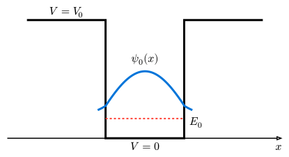

# 1次元束縛状態

定常状態のシュレーディンガー方程式 $hat(H) psi = E psi$ を解くことは、離散化されたハミルトニアン行列の**固有値問題**を解くことと等価です。

- **固有値 $E$**: エネルギー準位
- **固有ベクトル $vb(psi)$**: そのエネルギーに対応する定常状態の波動関数

## 例題：井戸型ポテンシャル

幅 $L$ の領域 $0 < x < L$ 内では $V(x) = 0$、外側では $V(x) = V_0$ となる井戸型ポテンシャルを考えます。
外側のポテンシャル $V_0$ が有限であれば波動関数は壁の外側にわずかに染み出し、無限大であれば境界で完全にゼロとなります。



離散化する場合、境界条件として両端で波動関数がゼロ（$psi_0 = psi_N = 0$）となるようにします。

## 固有値計算の実装（逆べき乗法）

行列の全ての固有値を求めるには高度なアルゴリズム（QR法など）が必要ですが、**最小の固有値（基底状態）** だけなら、**逆べき乗法 (Inverse Power Method)** で比較的簡単に求められます。

逆べき乗法は、適当な初期ベクトル $vb(x)$ に対して、行列 $vb(H)$ の逆行列を繰り返し掛けることで、絶対値最小の固有値に属する固有ベクトルへ収束させる手法です。
（ここではさらに簡略化して、$vb(H) - sigma vb(I)$ のようなシフトを用いず、単純に絶対値最小の固有値を探索します）

### Rustコード例

```rust
use ndarray::{Array1, Array2, Axis};
use ndarray_linalg::Solve; // 連立方程式を解くために必要 (実際には ndarray-linalg 推奨)

// 注: 以下のコードは概念説明用です。
// ndarray単体には逆行列や連立方程式ソルバーが含まれていないため、
// 本格的な計算には `ndarray-linalg` クレートの導入を推奨します。
// ここでは、アルゴリズムの流れを示します。

struct QuantumSystem {
    n_grid: usize,
    dx: f64,
    potential: Array1<f64>,
}

impl QuantumSystem {
    fn new(n: usize, l: f64) -> Self {
        Self {
            n_grid: n,
            dx: l / (n as f64),
            potential: Array1::zeros(n), // 自由粒子 (V=0)
        }
    }

    // ハミルトニアン行列とベクトルの積 H * psi を計算
    fn apply_hamiltonian(&self, psi: &Array1<f64>) -> Array1<f64> {
        let n = self.n_grid;
        let mut h_psi = Array1::zeros(n);
        let coeff = -0.5 / (self.dx * self.dx);

        for i in 1..n-1 {
            // H = K + V
            // Kinetic part: -1/2 * (psi[i+1] - 2psi[i] + psi[i-1]) / dx^2
            let kinetic = coeff * (psi[i+1] - 2.0 * psi[i] + psi[i-1]);
            let potential = self.potential[i] * psi[i];
            h_psi[i] = kinetic + potential;
        }
        h_psi
    }
    
    // レイリー商によるエネルギー期待値の計算 <psi|H|psi> / <psi|psi>
    fn expected_energy(&self, psi: &Array1<f64>) -> f64 {
        let h_psi = self.apply_hamiltonian(psi);
        psi.dot(&h_psi) / psi.dot(psi)
    }
}

// 虚時間発展法 (Imaginary Time Evolution)
// 基底状態を求めるための強力な手法。
// d/dt |psi> = -H |psi> という拡散方程式を解くと、
// 時間とともにエネルギーの高い成分が減衰し、基底状態だけが残る。
fn find_ground_state(sys: &QuantumSystem) -> Array1<f64> {
    let mut psi = Array1::from_elem(sys.n_grid, 1.0); // 初期状態
    let dt = 0.001; // 虚時間の刻み
    
    // 単純なオイラー法での更新: psi(t+dt) = psi(t) - dt * H * psi(t)
    // (実際には正規化が必要)
    for _ in 0..10000 {
        let h_psi = sys.apply_hamiltonian(&psi);
        psi = &psi - &(&h_psi * dt);
        
        // 正規化
        let norm = psi.dot(&psi).sqrt();
        psi.mapv_inplace(|x| x / norm);
    }
    psi
}

fn main() {
    let sys = QuantumSystem::new(100, 1.0);
    let ground_state = find_ground_state(&sys);
    let energy = sys.expected_energy(&ground_state);
    
    println!("Ground state energy: {:.4}", energy);
    // 理論値 E1 = pi^2 / 2 approx 4.935 (L=1, m=1, hbar=1)
}
```

### 虚時間発展法

上記のコード例では、逆べき乗法の代わりに**虚時間発展法 (Imaginary Time Evolution)** を使用しました。
シュレーディンガー方程式の時間を $t -> -i tau$ と置換すると、拡散方程式になります。

$$ pdv(psi, tau) = - hat(H) psi $$

解は $psi(tau) = sum c_n e^(- E_n tau) phi_n$ となり、$tau -> infinity$ で最小のエネルギー $E_0$ を持つ項（基底状態）以外は指数関数的に減衰して消滅します。
これは基底状態を求めるための非常に汎用的で強力な手法です。
