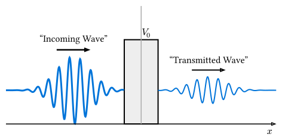

# 散乱問題とトンネル効果

量子力学特有の現象として最も有名なのが**トンネル効果 (Quantum Tunneling)** です。
古典力学では乗り越えられないエネルギーの障壁を、量子的な粒子は確率的に透過してしまう現象です。

## シミュレーション設定

- **初期状態**: ガウス波束（ある平均運動量 $k_0$ を持って右へ進む粒子）
- **ポテンシャル**: 経路の途中に壁（ポテンシャル障壁 $V(x) > 0$）を設置



## Rustによる実装（簡易版）

ここでは、簡易的な陽解法（安定性に難ありですが、$Delta t$ を十分小さくすれば短時間は動作します）を用いたデモコードを示します。本格的には前節のスプリット演算子法かクランク・ニコルソン法を使用してください。

```rust
use num_complex::Complex64;
use std::f64::consts::PI;

const N: usize = 200;
const L: f64 = 100.0;
const DT: f64 = 0.05;
const DX: f64 = L / N as f64;

fn main() {
    // 波動関数の初期化 (ガウス波束)
    let mut psi: Vec<Complex64> = (0..N).map(|i| {
        let x = i as f64 * DX;
        let x0 = L / 4.0;
        let sigma = 5.0;
        let k0 = 2.0; // 平均運動量

        // exp(-(x-x0)^2 / 2sigma^2) * exp(i k0 x)
        let envelope = (-(x - x0).powi(2) / (2.0 * sigma.powi(2))).exp();
        let phase = Complex64::from_polar(1.0, k0 * x);
        Complex64::new(envelope, 0.0) * phase
    }).collect();

    // ポテンシャル障壁
    let v: Vec<f64> = (0..N).map(|i| {
        let x = i as f64 * DX;
        if x > L/2.0 && x < L/2.0 + 5.0 { 1.5 } else { 0.0 }
    }).collect();

    // 時間発展ループ
    for t in 0..200 {
        if t % 20 == 0 {
            // ここで |psi|^2 を出力してプロットすると、波束の動きが見える
            println!("Step {}: max probability = {:.4}", t,
                psi.iter().map(|z| z.norm_sqr()).fold(0.0/0.0, f64::max));
        }

        // オイラー法 (不安定なので注意)
        // psi(t+dt) = psi(t) - i * dt * H * psi(t)
        let mut next_psi = psi.clone();
        for i in 1..N-1 {
            let kinetic = -0.5 * (psi[i+1] - 2.0*psi[i] + psi[i-1]) / (DX*DX);
            let potential = v[i] * psi[i];
            let h_psi = kinetic + potential;

            next_psi[i] = psi[i] - Complex64::i() * DT * h_psi;
        }
        psi = next_psi;
    }
}
```

## 結果の観察

このシミュレーションを実行すると、波束が壁に衝突した際、一部が反射し、一部が壁を通り抜けて透過していく様子が観察できます。
壁の高さが粒子のエネルギーよりも高くても、透過波が存在することが確認できます。

## 透過係数と反射係数

壁の向こう側（透過領域）における確率密度の積分値が**透過係数 (Transmission Coefficient)** です。

$$ T = integral_("barrier end")^infinity |psi(x, t)|^2 dd(x) $$

十分に時間が経過した後、この $T$ は定数値に収束します。解析解と比較することで、シミュレーションの精度を検証できます。
