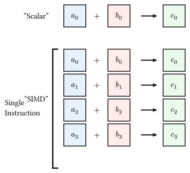

# SIMD最適化

**SIMD (Single Instruction, Multiple Data)** は、1つのCPU命令で複数のデータを同時に処理するハードウェア機能です。
現代のCPUには、x86のAVX/AVX-512やArmのNEONといったSIMD命令セットが搭載されており、これらを活用することで、演算性能を数倍に高めることができます。

## SIMDの概念

通常の演算（Scalar）が 1 + 1 を行うのに対し、SIMDでは例えば 8個の浮動小数点数を一度に足し合わせます。



$$ vb(a) + vb(b) = (a_0 + b_0, a_1 + b_1, dots.c, a_7 + b_7) $$

## RustでのSIMD

RustでSIMDを利用するには、主に以下の3つのアプローチがあります。

### 1. オートベクタライズ (Auto-vectorization)

コンパイラ (LLVM) がコードを解析し、可能であれば自動的にSIMD命令を生成します。
開発者は特別なコードを書く必要はありませんが、ループの構造やメモリの連続性に配慮する必要があります。

### 2. クレートの利用 (ndarrayなど)

`ndarray` などの数値計算ライブラリは、内部でSIMDを活用した最適化が行われています。ライブラリのメソッド（`dot` など）を使うだけで、恩恵を受けられます。

### 3. 明示的なSIMD (std::simd)

RustのNightlyチャンネルで開発されている `portable-simd` を使うと、ポータブルな（CPUアーキテクチャに依存しない）形でSIMDコードを記述できます。

```rust
// Nightly Rustが必要
#![feature(portable_simd)]
use std::simd::f64x4;

fn main() {
    let a = f64x4::from_array([1.0, 2.0, 3.0, 4.0]);
    let b = f64x4::from_array([5.0, 6.0, 7.0, 8.0]);
    
    // 一度の命令で4つの加算が行われる
    let c = a + b;
    
    assert_eq!(c.to_array(), [6.0, 8.0, 10.0, 12.0]);
}
```

## SIMDとメモリ配置

SIMDの性能を引き出すには、データがメモリ上に**連続して配置されていること (Contiguous Memory Layout)** が不可欠です。

計算物理においては、粒子データの「構造体の配列 (AoS: Array of Structures)」を「配列の構造体 (SoA: Structure of Arrays)」に組み替えることで、SIMDが効きやすくなることがよくあります。

### AoS vs SoA のコード例

```rust
// AoS: 直感的な構造体

struct Particle {

    x: f64, y: f64, z: f64,

    vx: f64, vy: f64, vz: f64,

}

let particles: Vec<Particle> = vec![...];


// SoA: SIMDに優しい構造

struct ParticlesSoA {

    x: Vec<f64>,

    y: Vec<f64>,

    z: Vec<f64>,

}

let p_soa = ParticlesSoA {

    x: vec![1.0, 2.0, ...],

    y: vec![3.0, 4.0, ...],

    z: vec![5.0, 6.0, ...],

};


// SoAでの計算例（コンパイラがオートベクタライズしやすい）

fn update_positions(p: &mut ParticlesSoA, dt: f64) {

    p.x.iter_mut().zip(&p.vx).for_each(|(x, vx)| *x += vx * dt);

    // x方向の演算、y方向の演算がそれぞれ連続したメモリ領域で行われるため

    // 1つのSIMD命令で8個程度の粒子を同時に処理できる

}
```

SoA形式にすると、同じ座標軸のデータを一気にSIMDレジスタにロードできるため、CPUのキャッシュ効率と演算効率が大幅に向上します。

物理シミュレーションを極限まで高速化したい場合、このデータ構造の設計が鍵となります。
